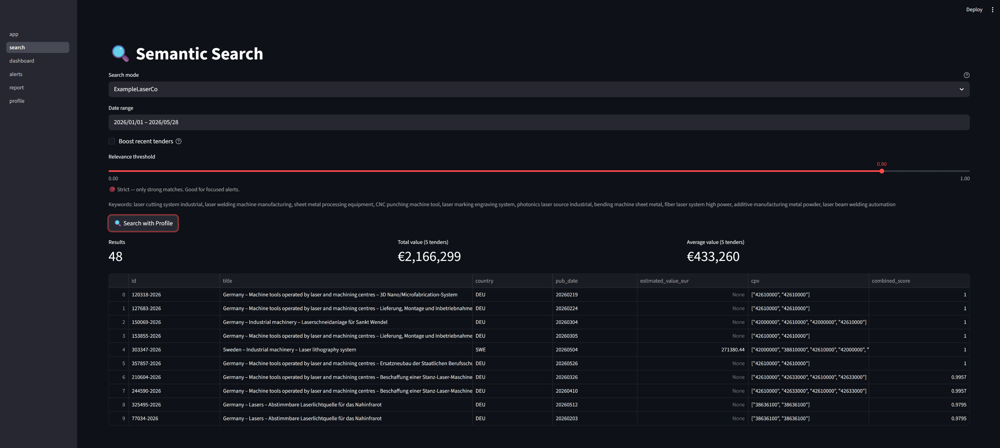

# TED Procurement Monitor

Automated tender discovery tool that monitors the EU's public procurement platform and delivers relevant opportunities directly by email, without manual searching.



## Features

- **Idempotent data pipeline** — downloads tender notices daily from the TED API for any given timeframe; dates already fetched are never re-queried
- **Manual search** — query notices in natural language with optional CPV code filters and a date range
- **Profile-based search** — define a company profile with keywords, negative keywords, and preferred countries; the scoring engine ranks every tender against your full business context
- **Relevance tuning** — filter out noise by setting a minimum score for both search modes with the option to boost recent tenders or not.
- **Email alerts** — schedule automated email digests on selected weekdays, triggered by a saved search or manual set up
- **Report page** — each alert email includes a direct link to a full interactive report in the dashboard
- **Geographic distribution** — visualize where matched tenders were published across Europe
- **Extensible architecture** — built around a `BaseExtractor` interface; adding a new data source requires implementing an extractor and a transformer class
- **Designed for automation** — intended to run daily via a scheduled task (cron, Task Scheduler) on any server or local machine

## Architecture

The pipeline starts by calling a `BaseExtractor` subclass to fetch raw notices from the TED API for a given date. Each notice is normalized by a source-specific transformer to match the `StandardNotice` model, then enriched by a global transformer that handles Pydantic validation and EUR currency conversion. Validated notices are stored in a SQLite database and simultaneously indexed in ChromaDB using the `paraphrase-multilingual-mpnet-base-v2` sentence embedding model. 
At search time, queries are embedded and matched against the vector index; results are hydrated from SQLite, scored using a weighted combination of semantic similarity and recency, and filtered by threshold before being returned to the dashboard.

## Prerequisites & Installation

**Requirements:**
- Python 3.14+
- Git

**Install:**
```bash
git clone https://github.com/RobinSmol/ted-procurement-monitor.git
cd ted-procurement-monitor
pip install -r requirements.txt
```

**Optional — GPU acceleration:**  
If you have a CUDA-compatible GPU, replace the `torch` line in `requirements.txt` with the appropriate CUDA version from [pytorch.org](https://pytorch.org/get-started/locally/) to speed up embedding generation. The tool runs fine on CPU by default.

## Configuration

Copy `.env.example` to `.env` and fill in the values following the comments in the file:

```bash
cp .env.example .env
```

The SMTP configuration is set up for [Brevo](https://www.brevo.com). You will need a free Brevo account and an SMTP key to enable email alerts.

## Usage

**Run the pipeline** (fetches today's notices from TED and processes alerts):

```bash
python main.py
```

**Launch the dashboard** (search, alerts, and profiles):

```bash
streamlit run app.py
```

To automate daily data collection, schedule `python main.py` as a cron job (Linux/macOS) or a Task Scheduler task (Windows).

## Running Tests

Install the dev dependencies first, then run the tests.
```bash
pip install -r requirements-dev.txt
pytest tests/
```

## License

This project is licensed under the MIT License with the Commons Clause condition — you are free to use, modify, and distribute this software, but you may not sell it or offer it as a commercial service. See the [LICENSE](LICENSE) file for details.